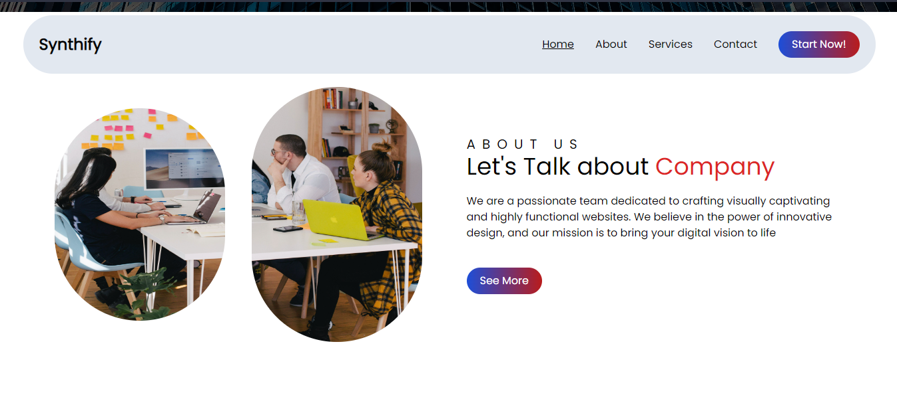

# A Simple Static Website with Tailwind CSS

## This is a simple landing page company website that created with HTML, Tailwind CSS, and Javascript

The website is responsive, at least it fits mobile, tablet, and desktop view. Here's what I've done:

* Create an NPM folder
* Download Tailwind CSS via NPM
* Set the Tailwind config file
* Build the website and make it responsive
* Runt the website on my local server via node.js

## Website preview

## How to install this project?

Keep in mind that this is a node app, you have to install node and run in in node server!

1. Download and install [Node.js](https://nodejs.org/en)
2. Open your terminal and run `npm install`
3. Run the code on your local node server by `npm run dev` to develop the project
4. To see the full website, just open the index.html on your browser

## Find a bug?
If you found an issue or would like to submit an improvement to this project, please submit an issue using the issue tab above.